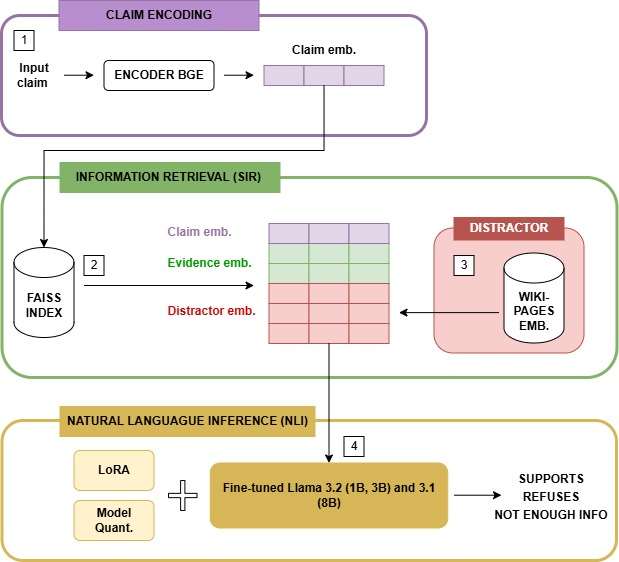
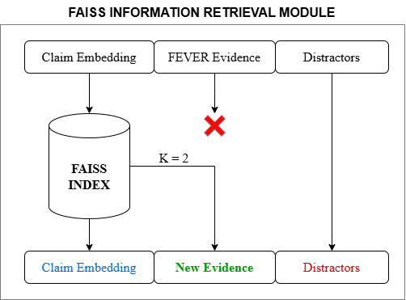
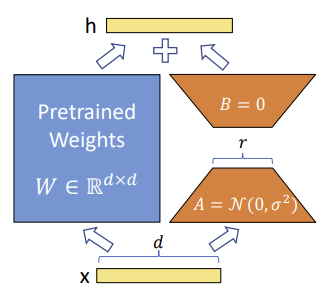
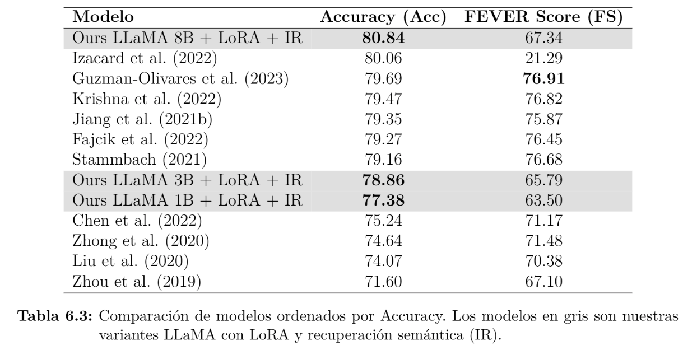
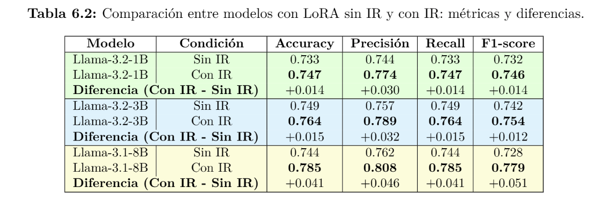
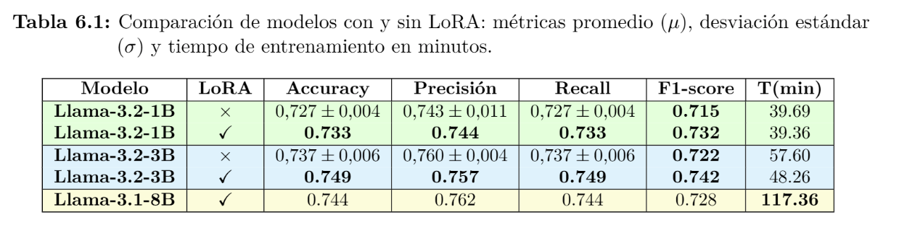

# Misinformation-verification-NLI-IR

## Architecture

### Overall Architecture

### IR Module (FAISS)

### LoRA Integration

---

## Experimental Results

### Img1: State-of-the-art Comparison

### Img2: With vs Without IR

### Img3: With vs Without LoRA

